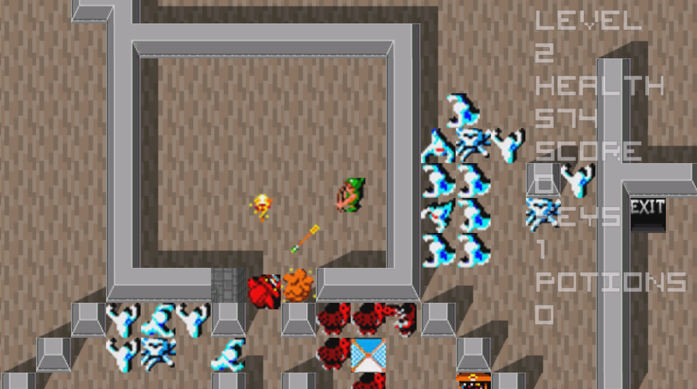

# Gauntlet
  
> Clicking on the image opens a rather large gif (43 mb).

This is my attempt at recreating the classic arcade game Gauntlet in C++. This was a school project. The framework that manages graphics and input is supplied by the school.

> All my documentation in placed in a folder at the root called docs/.

## How to run it
Navigate to releases to download the binaries. Just run the .exe. Be sure that the folder is not zipped and that the folder structure is the same.

## How to build it
It is build using Visual Studio 2017. The solution file is located in proj/VS2017/. You can use the MSVC with this or open in with VS2017 and build it. 